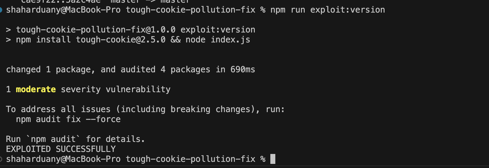

# tough-cookie v2.5.0 Patched

This repository contains data from the patch of the [CVE-2023-26136](https://nvd.nist.gov/vuln/detail/CVE-2023-26136) security volunerability in the  [tough-cookie](https://github.com/salesforce/tough-cookie) package for [v2.5.0](https://github.com/salesforce/tough-cookie/tree/v2.5.0).

The [patch package version in a forked repository be found here](https://github.com/shaharduany/tough-cookie/tree/v2.5.0-PATCHED).
The [PR patching the v2.5.0 can be found here](https://github.com/shaharduany/tough-cookie/pull/1)

## Files overview

* **tough-cookie-2.5.0-PATCHED.tgz** - Package of the patched tough-cookie v2.5.0
* **changes.diff** - A git.diff file of the changes done for the patch - Can use `git apply changes.diff` on a clean v2.5.0 clone with no rejects.
* **index.js** - An index file outputting result if the package can still be exploited
* **.nvmrc** - To easily switch to the version requested (20 LTS) - `nvm use`

## Voluneerability Overview

The [CVE-2023-26136](https://nvd.nist.gov/vuln/detail/CVE-2023-26136) is a securty report of the [CWE-1321](https://cwe.mitre.org/data/definitions/1321.html), also referred to as Prototype Pollution.

**CWE Name:** Improperly Controlled Modification of Object Prototype Attributes ('Prototype Pollution')

**CWE ID:** CWE-1321

The voluneerability is when the attacker manages manipulate the prototype by injecting bad payload.

In this case, there was an ability to exploit the property by injecting `__proto__` as the domain.
The cookies before the fix were stored in a variable of type Object.
When the cookie is stored, it uses the domain as the key.
Inside it, it stores the cookies in the order
`{ path: value }` 

The way this can be exploited, is if provided domain name `__proto__` (A getter to the prototype), we can override properties of the Object prototype.
This can be used to cause downtime if overriding critical methods (Example, `Object.keys()`), or injecting data to the server.

In other wors, in the putCookie() code before that

```
  putCookie(cookie, cb) {
    if (!this.idx[cookie.domain]) {
      this.idx[cookie.domain] = {};
    }
    if (!this.idx[cookie.domain][cookie.path]) {
      this.idx[cookie.domain][cookie.path] = {};
    }
    this.idx[cookie.domain][cookie.path][cookie.key] = cookie;
    cb(null);
  }
```

If `cookie.domain === '__proto__'`, it leads the code to execute this line `this.idx.__proto__[path][key] = value`, which then we can use change the Object prototype.

This issue was resolved by switching the store declartion to `Object.create(null)` which creates an object with a `null` prototype - which then, when accessing `__proto__` it returns null.

## Test suits

I added the test suits done in the PR fixing the voluneerability in the Salesforce tough-cookie PR [#282](https://github.com/salesforce/tough-cookie/pull/283)

And added an additional unit test.
I ran the tests using `npm run test` inside the package.
I also had to remove deprecated tests for all the tests to run.

### Test suite result


### Same additional tests fail in v2.5.0 (With 3 deprecated tests)


### Test suite of v2.5.0 (With the 3 deprecated)


### The additional tests:

```js
.addBatch({
    "Issue #282 - Prototype pollution": {
      "when setting a cookie with the domain __proto__": {
        topic: function() {
          const jar = new tough.CookieJar(undefined, {
            rejectPublicSuffixes: false
          });
          // try to pollute the prototype
          jar.setCookieSync(
            "Slonser=polluted; Domain=__proto__; Path=/notauth",
            "https://__proto__/admin"
          );
          jar.setCookieSync(
            "Auth=Lol; Domain=google.com; Path=/notauth",
            "https://google.com/"
          );
          this.callback();
        },
        "results in a cookie that is not affected by the attempted prototype pollution": function() {
          const pollutedObject = {};
          assert(pollutedObject["/notauth"] === undefined);
        }
      },
    },
     "Issue #282 - Prototype pollution - V2.5.0 Patch": {
      "when setting a cookie with the domain __proto__ and path keys": {
        topic: function() {
          var jar = new tough.CookieJar(undefined, {
            rejectPublicSuffixes: false
          });
          var objectKeysFunctionRef = Object.keys;
          // try to pollute the prototype
          jar.setCookieSync(
            "Slonser=polluted; Domain=__proto__; Path=keys",
            "https://__proto__/admin"
          );
          
          return objectKeysFunctionRef;
        },
        "results in Object.keys() is not affected by the attempted prototype pollution": function(objectKeysFunctionRef) {
          assert.strictEqual(objectKeysFunctionRef, Object.keys);
        }
      },
      "When setting a cookie with the domain __proto__ and path __defineGetter__": {
        topic: function() {
          var jar = new tough.CookieJar(undefined, {
            rejectPublicSuffixes: false
          });
          jar.setCookieSync(
            "Slonser=polluted; Domain=__proto__; Path=__defineGetter__",
            "https://__proto__/admin"
          );
          this.callback();
        },
        "results in Object.__defineGetter__() is not affected by the attempted prototype pollution": function() {
          const pollutedObject = { "foo": "bar" };
          assert(pollutedObject.foo === "bar");
        }
      }
    }
  })
  ```

## Scripts for easier index.js testing:

In the [forked repository](https://github.com/shaharduany/tough-cookie/tree/v2.5.0-PATCHED) I ran the tests using `npm run test` to test them.

For easier testing and debugging the `index.js` in this repository, I added these tests

* `npm run exploit:version` - will run the `npm install tough-cookie@2.5.0 && node index.js`
* `npm run patched:version` - Will run the `npm install ./tough-cookie-2.5.0-PATCHED.tgz && node index.js`
* `npm run test` - Will run `exploit:version` and `patched:version` with echos signaling when it starts and finishes - **It is not a real test suite, just the output requested at the assignemnt**

### Outputs

#### npm run exploit:version



#### npm run patched:version


#### git apply changes.diff


#### git v2.5.0-PATCHED tag

